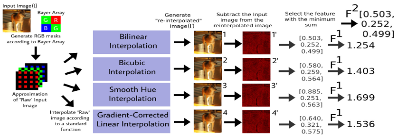

# AI-Generated Image Classifiers

Research code for detecting AI-generated images (AIGC) using novel Color Filter Array (CFA) interpolation techniques and fine-tuned CNNs. Published at **IEEE BigData 2023**.

> **Investigating the Effectiveness of Deep Learning and CFA Interpolation Based Classifiers on Identifying AIGC**  
> Michael Reidy, Henry Mallon, Jiebo Luo · University of Rochester  
> 

---

*The framework for generating the features F1 and F2 from a source image.*

## Overview

As AI image generation has become increasingly convincing, distinguishing AI-generated content from genuine photographs is an open problem with real implications for misinformation. This paper investigates two complementary detection strategies:

1. **Fine-tuned CNNs** — ResNet50, DenseNet121, and InceptionV3, each modified for binary classification and trained on composite datasets of real and AI-generated images
2. **CFA-based classifiers** — two novel approaches exploiting Color Filter Array interpolation artifacts that are present in genuine camera images but absent in AI-generated ones

Both strategies are evaluated on a sparse dataset (same subject/size) and a diverse dataset (mixed subjects and sizes) to test generalization.

---

## Getting Started

1. Clone the repo
2. Open MATLAB and set your current folder to the repo root
3. Update `IMAGE_PATH` in `cfa_demo.m` to desired image
4. Run `cfa_demo.m`

---

## Results

**CNNs trained on the diverse dataset:**

| Model | Accuracy | F1 Score | ROC-AUC |
|---|---|---|---|
| ResNet50 | 84.62% | 0.8478 | 0.942 |
| DenseNet121 | 84.61% | 0.8618 | 0.929 |
| InceptionV3 | **86.08%** | **0.8774** | 0.930 |

**CFA classifiers trained on the sparse dataset:**

| Model | Accuracy | F1 Score |
|---|---|---|
| CFA Thresholding (F¹) | 76.42% | 0.6960 |
| CFA Deep-Learning (F²) | 86.82% | 0.8396 |

CNNs outperformed CFA classifiers overall. Notably, the thresholded CFA classifier (F¹) achieves **higher-than-human accuracy** on both datasets without any deep learning.

---

## Approach

### Deep Learning

ResNet50, DenseNet121, and InceptionV3 are adapted for binary classification by replacing their final classification layers with a GlobalAveragePooling2D layer and a sigmoid-activated dense layer. Models are trained with binary cross-entropy loss and the Adam optimizer on an 80/10/10 train/validation/test split.

### CFA Percent Error Thresholding (F¹)

Real photographs captured by digital cameras must pass through a Color Filter Array — typically a Bayer array — which records only one color channel per pixel. The missing values are then estimated via interpolation, leaving behind low-level statistical artifacts. AI-generated images (produced by GANs and LDMs) are never raw-interpolated, so they don't share these pixel color relations.

This classifier re-interpolates an input image using four standard algorithms (bilinear, bicubic, smooth hue, and gradient-corrected linear) and computes the percent error between the original and re-interpolated image. A threshold on this error distinguishes real from AI-generated images.

### CFA Percent Error with Neural Networks (F²)

A second feature vector F² captures the per-channel (R, G, B) percent error from the best-performing interpolation algorithm. This 1x3 feature is fed into a small feed-forward neural network, allowing for more flexible decision boundaries than simple thresholding.

---

## Datasets

Two composite datasets were assembled from Kaggle sources:

**Sparse dataset** — same subject category and image size (300x300 faces, StyleGAN2-generated)

**Diverse dataset** — mixed subjects, sizes, and generation methods:

| Source | Real Images | AI Images | Generation Method |
|---|---|---|---|
| Fake-Vs-Real-Faces (Hard) | 589 | 700 | StyleGAN2 |
| Real vs Fake Face Classification | 665 | 532 | GAN |
| AI Cat and Dog Images DALL·E Mini | 0 | 108 | DALL·E Mini |
| Cat and Dog | 206 | 0 | — |

All images are in JPG format.

---

## Research Context

Conducted in the [Computer Vision Lab](https://www.cs.rochester.edu/u/jluo/) at the University of Rochester under the supervision of **Dr. Jiebo Luo**, March 2023 – January 2025.
